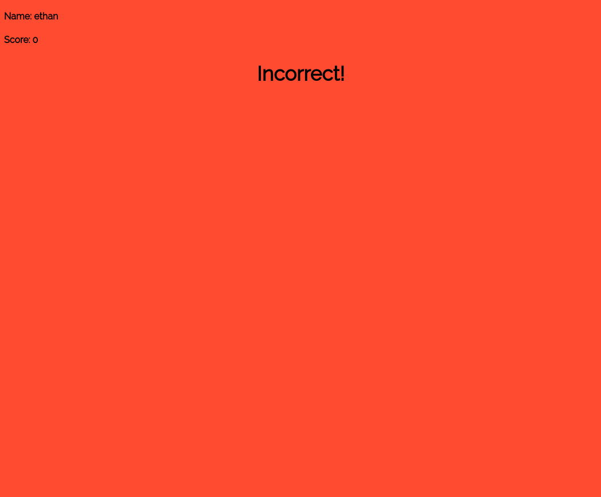

# kahoot-clone-nodejs

Description
- This project is a kahoot clone that uses nodejs and mongodb. Multiple games can be ongoing at one time and works with many players per game.
- Can login with google email. The google mail with anyname can represent for teacher. And the email initial with 4 digits number can be represent for student. For example, 1234@gmail.com can be use as student email.
- Teacher and student sessions is different. teacher can set up, reviews, and also check for the answer that which students answerd wrong. But stuedent can only answer the quiz.
- the algorithms for teacher-student check can be change on file server/server.js line 90 so on.

Installation
- require nodejs https://nodejs.org/en/
- require mongodb local https://docs.mongodb.com/manual/tutorial/install-mongodb-on-os-x/
- run command 'npm install' to initialize project and install other required mudules
- start server with command 'node server/server.js'

Screen Shots:

